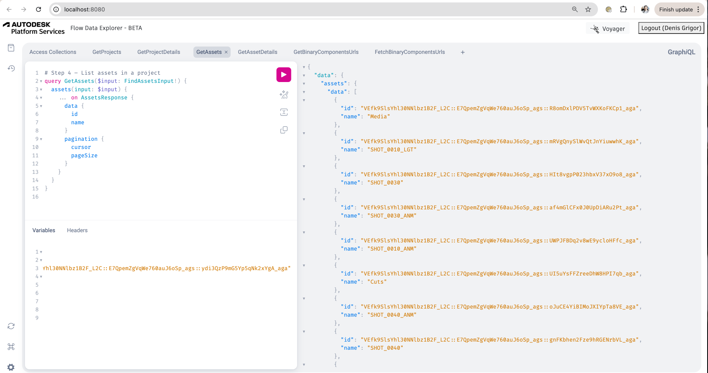
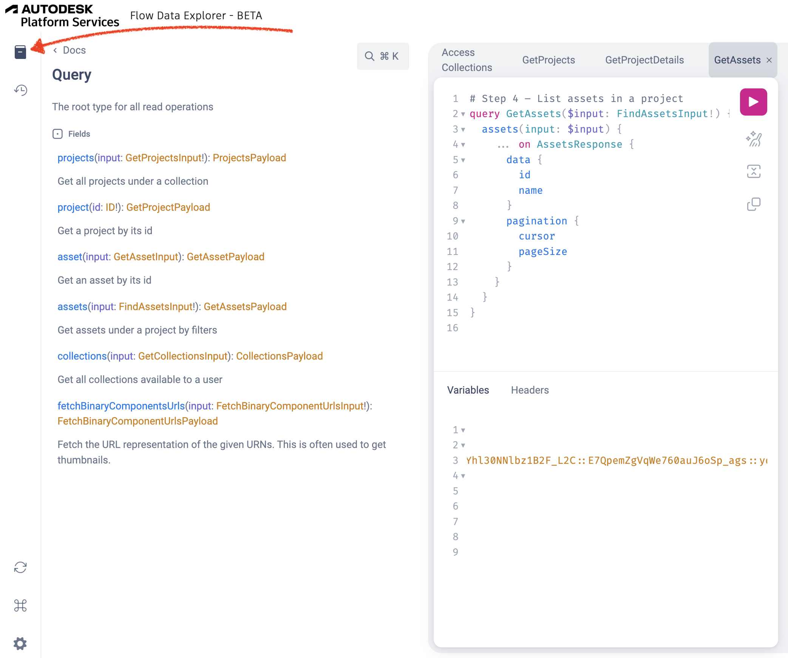
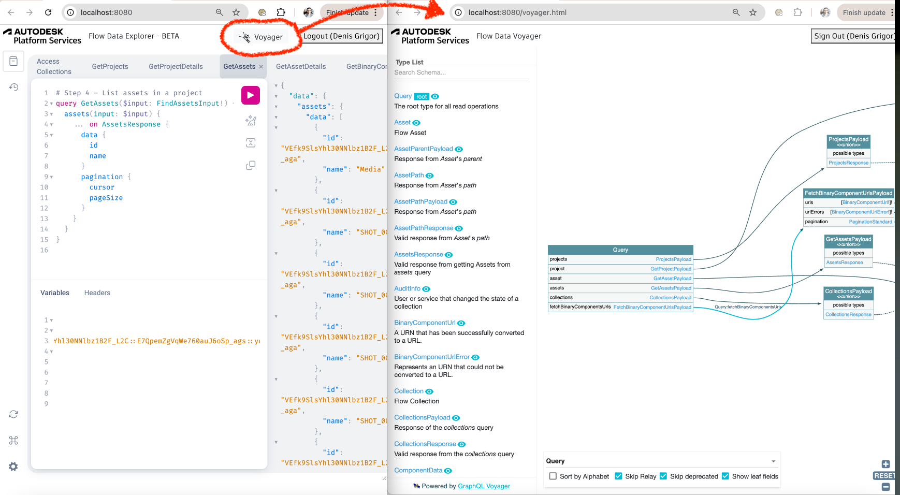

# Aps Flow Data Explorer

The sample is using this [GraphiQL project](https://github.com/graphql/graphiql) that makes it really easy to discover the Flow Data API through GraphQL.

# Thumbnail


## Setting up the app

- clone this repository or download
- restore the packages
- replace the variable values at appsettings.Development.json with your own

```json
{
  "APS_CLIENT_ID": "YOUR CLIENT ID",
  "APS_CLIENT_SECRET": "YOUR CLIENT SECRET",
  "APS_CALLBACK_URL": "http://localhost:8080/api/auth/callback"
}
```

**Make sure your APS app also uses the same callback url!**

## Running the app

As instructed in the console, you'll need to open a web browser and navigate to http://localhost:8080 in order to log into your Autodesk account

## Output

Once you logged in with your Autodesk account in the browser, this should appear:



This sample comes by default with the step-by-step tutorial queries in multiple tabs. You can run the queries available in these tabs and add your own.

You can also check the documentation:




---

## Tips & Tricks

You can also see the schema in a nice way using [GraphQL Voyager](https://graphql-kit.com/graphql-voyager/):



## Troubleshooting

1. **Cannot load viewer**: Make sure you're logged in and using a valid exchange Id.

2. **Filter Extension doesn't highlight elements**: Make sure you're using the exchange urn compatible with the exchange id used in the queries.

## Written and updated by

- Denis Grigor  [Developer Advocate and Support](http://aps.autodesk.com)
